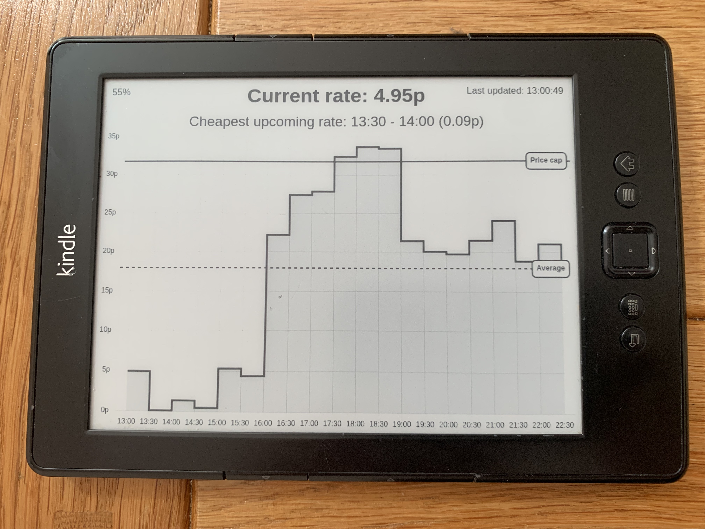
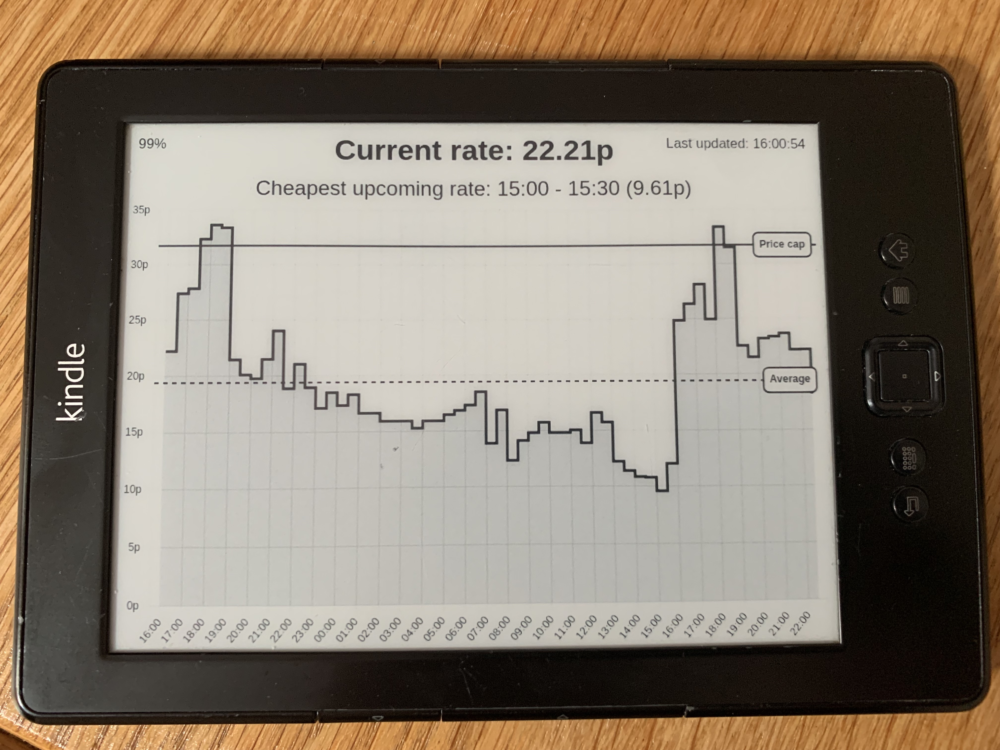

# Octopus Agile Dashboard for Kindle

Kindle dashboard of upcoming Octopus Agile electricity prices. The rates for the next day are displayed as soon as they become available (about 4pm each day).

## Features

- Graph of all upcoming Agile rates for a given region
- Current rate
- Cheapest upcoming rate and time
- Line indicating the average upcoming rate
- Line indicating the Ofgem price cap
- Battery indicator top right
- Last updated time top right
- Updates every half an hour
- Suspends to RAM between reloads so the Kindle can run on battery for a long time between charges

### Before next day rates are published

 

### After next day rates are published

 

## Prerequisites

- A jailbroken Kindle, with Wi-Fi configured
- An SSH server on the Kindle (via USBNetwork)
- A Cloud Function or some other server to host the node.js endpoint
- Tested only on a Kindle 4 NT. Should work on other Kindle devices as well with minor modifications

## Instructions

This solution relies on technique and code from https://github.com/pascalw/kindle-dash repository (thank you!). The `index.html` file fetches the rates from the Octopus API and renders them as a dashboard using Chart.js. The `index.js` file contains a single node.js endpoint that uses Phantom.js (headless Chrome) to open the `index.html` page and save a screenshot as a greyscale PNG sized to the dimensions of the Kindle (800x600). The code on the [Kindle](https://github.com/rstreefland/kindle-octopus-agile-dashboard/tree/main/kindle) fetches the image from the endpoint once every half an hour to and displays it to ensure the dashboard stays up to date.

### Dashboard page ([index.html](https://github.com/rstreefland/kindle-octopus-agile-dashboard/blob/main/index.html#L50))

Change the [tariff in the URL](https://github.com/rstreefland/kindle-octopus-agile-dashboard/blob/main/index.html#L50)https://github.com/rstreefland/kindle-octopus-agile-dashboard/blob/main/index.html#L50 to the one appropriate for your region if needed. If you wish to see your changes to the dashboard, it can be opened in a web browser. Append the query parameter to the URL `?batteryPercentage=100` to simulate a battery percentage.

The Ofgem price cap is currently hardcoded. Update [OFGEM_PRICE_CAP](https://github.com/rstreefland/kindle-octopus-agile-dashboard/blob/main/index.html#L53) as necessary.

### Node.js endpoint ([index.js](https://github.com/rstreefland/kindle-octopus-agile-dashboard/blob/main/index.js))

This endpoint will deploy as a Google Cloud Function using the [gcloud CLI](https://cloud.google.com/sdk/gcloud) out of the box but it will also deploy to any environment capable of hosting node.js services.

1. Run `npm install`
2. Run `npm run deploy`
3. Set the `TOKEN` environment variable to a secret token (this will be used by the Kindle to access the endpoint)
4. Verify the endpoint works by opening https://REPLACE_ME_WITH_YOUR_URL?token=REPLACE_ME_WITH_YOUR_TOKEN in a browser
5. The image of the dashboard should open

### Kindle

1. Jailbreak your Kindle and install an SSH server
2. [Replace the placeholders here](https://github.com/rstreefland/kindle-octopus-agile-dashboard/blob/main/kindle/local/fetch-dashboard.sh) with your the URL of your deployed endpoint and `TOKEN` configured in the previous step
3. Copy the files to the Kindle, for example: `rsync -vr ./kindle root@192.168.15.244:/mnt/us/dashboard`. This assumes that `192.168.15.244` is the IP address of your Kindle
4. SSH into the Kindle and start the dashboard with `/mnt/us/dashboard/start.sh`
5. The Kindle screen should refresh and the dashboard should be visible.

To stop the dashboard, press the power button on the Kindle, SSH into the Kindle, then run `/mnt/us/dashboard/stop.sh`. Pressing the power button wakes the Kindle from sleep for 10 seconds, so be quick!

